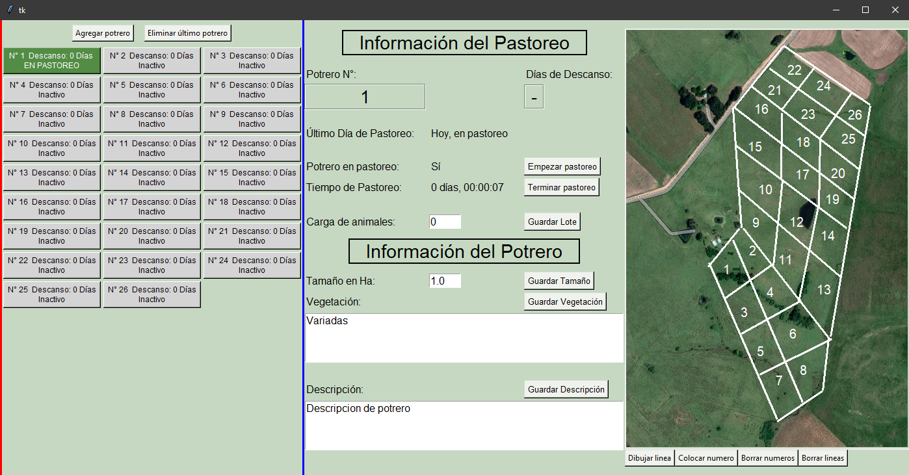

# PRV Grazing Rational Voisin
Desktop program to control breaks in Grazing Rational Voisin (PRV).  

Outstanding features  
• Manages and controls breaks in Grazing Rational Voisin efficiently.  
• Provides an intuitive and easy-to-use interface to configure and monitor the PRV.   
• Allows users to establish optimal rest times for grazing their cattle.  

Language: for now it is in Spanish  

Main interface of the PRV program.

